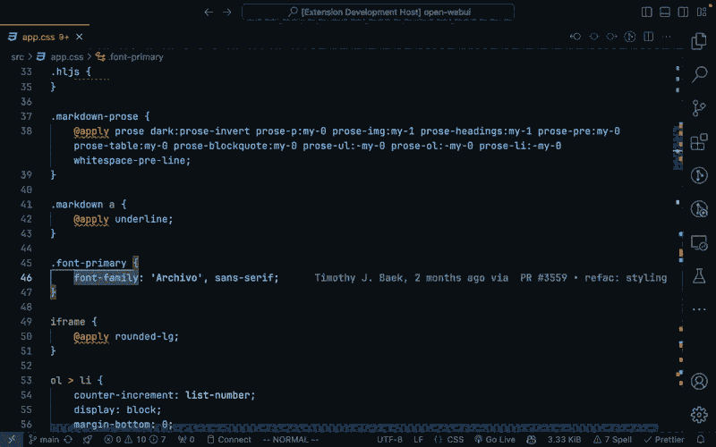

# Toggle Relative Line Numbers - VSCode Extension

A VSCode extension that allows you to toggle between absolute and relative line numbers in the editor.

## Installation

This extension can be installed via the VS Code [Marketplace](https://marketplace.visualstudio.com/items?itemName=habibium.toggle-relative-line-numbers).

## Usage

Use the shortcut (`ctrl+alt+l` by default) to toggle. Or:

1. Press `Ctrl+Shift+P` to open the command palette.
2. Search for "Toggle Relative Line Numbers" and press enter.
3. The line numbers in the editor will toggle between absolute and relative.

## Contributing

Contributions are welcome! Please fork the repository and submit a pull request.

## License

This extension is licensed under the [MIT License](../LICENSE).
